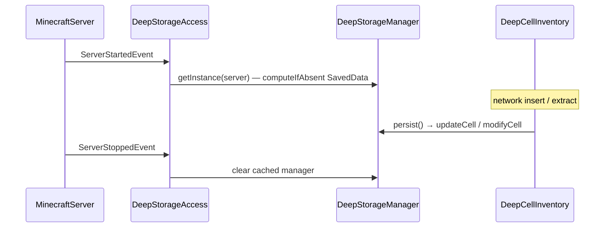
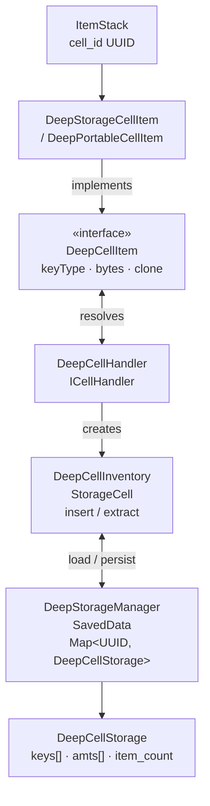

# Architecture

This document describes the internal design of AE2Objects and the architecture of the planned
fluid / chemical / MEGA-tier / portable expansion.

## 1. Goals and non-goals

**Goals**

- Provide storage cells with **no type limit**: any number of distinct types may be stored, bounded
  only by the cell's byte capacity.
- Support multiple AE2 key types through a single, reusable cell implementation:
  items (`AEKeyType.items()`), fluids (`AEKeyType.fluids()`), and chemicals
  (`me.ramidzkh.mekae2.ae2.MekanismKeyType.TYPE`).
- Reuse AE2's own cell registration, drive rendering, workbench, menus, and upgrade system.
- Keep heavy foreign integrations (MEGA Cells, Applied Mekanistics) **optional** and isolated so the
  mod loads and runs without them.

**Non-goals**

- Re-implementing AE2's inventory/cell framework.
- Replacing AE2's type-limited cells; deep cells are a separate, parallel item line.
- Storing huge numbers of *types* more efficiently than AE2; the deep cell simply removes the cap.

## 2. Package layout

| Package                     | Responsibility                                                                                                                            |
|-----------------------------|-------------------------------------------------------------------------------------------------------------------------------------------|
| `top.likoslupus.ae2objects` | `@Mod` entry point, creative-tab wiring, server lifecycle hooks.                                                                          |
| `...registry`               | Deferred registers for items and data components.                                                                                         |
| `...item`                   | Item classes: `DeepStorageCellItem`, `DeepPortableCellItem`.                                                                              |
| `...storage`                | Core storage model: `DeepCellStorage`, `DeepCellInventory`, `DeepCellHandler`, `DeepCellItem`, `DeepStorageManager`, `DeepStorageAccess`. |
| `...integration.ae2`        | Binding into AE2: cell handler registration, models, upgrade cards.                                                                       |
| `...integration.megacells`  | Optional MEGA Cells wiring (components, housings).                                                                                        |
| `...integration.appmek`     | Optional Applied Mekanistics wiring (chemical key type, validator, menu).                                                                 |
| `...data`                   | Data generation (recipes, advancements).                                                                                                  |
| `...command`                | `/ae2objects` commands (`getuuid`, `recover`).                                                                                            |
| `...client`                 | Client-only setup (`@Mod(dist = CLIENT)`).                                                                                                |
| `...mixin`                  | `CursedInternalSlotMixin` — deep-clones a cell when copied in a container menu.                                                           |

## 3. Storage model

### 3.1 External, UUID-keyed storage

Deep cells do **not** store their contents on the `ItemStack`. Instead each cell carries a `cell_id`
(UUID), and the actual contents live in a world-level `SavedData`:

```
ItemStack (cell_id = <UUID>)
        │
        ▼
DeepStorageManager  (SavedData, id = ae2objects:storage_manager)
        │  Map<UUID, DeepCellStorage>
        ▼
DeepCellStorage  { keys: ListTag, amts: long[], item_count: long }
```

- `DeepStorageManager` — persisted `SavedData`; stores `Map<UUID, DeepCellStorage>` and holds a weak
  reference to the server's `HolderLookup.Provider` for AE key (de)serialization.
- `DeepStorageAccess` — process-wide accessor. Populated on `ServerStartedEvent`, cleared on
  `ServerStoppedEvent`. Used by the cell handler and items.
- `DeepCellStorage` — immutable-style container of serialized `AEKey`s (`keys`), their amounts
  (`amts`, parallel `long[]`), and the cached total `item_count`. `copy()` is a true deep copy.

This design makes cloning a cell cheap and consistent, and lets the recovery command reconstruct a
cell from its UUID alone.

### 3.2 `DeepCellItem` — the cell marker interface

`DeepCellItem extends ICellWorkbenchItem` marks an item as a deep cell and exposes the small surface
AE2Objects needs:

- `AEKeyType getKeyType()` — which key space the cell accepts.
- `int getBytes(ItemStack)` — the cell's total byte capacity.
- `double getIdleDrain()`
- `ConfigInventory getConfigInventory(ItemStack)`
- `ItemStack clone(ItemStack)` — deep clone used by the copy mixin.
- `default long amountPerUnit()` — planned addition; equals `getKeyType().getAmountPerUnit()`.
- `default boolean supportsFuzzy()` — planned addition; `true` for items, `false` for
  fluids/chemicals.

The interface also carries an `isBlackListed` hook (default: reject non-empty storage cells) that
the chemical cell overrides to reject invalid chemicals.

### 3.3 `DeepCellInventory` — the `StorageCell`

`DeepCellInventory` implements AE2's `StorageCell` and is created by `DeepCellHandler`. It is
responsible for:

- Loading the key→amount map from either `DeepStorageManager` (server; authoritative) or the item's
  `STORAGE_CELL_INV` preview component (client; last synchronized preview).
- Filtering (whitelist/blacklist + optional fuzzy) via `IPartitionList`.
- `insert` / `extract` in `Actionable` mode, writing through to `DeepStorageManager`.
- Persisting a short preview list + counts to the item for tooltips and the client.

**Byte math (key-type aware).** The planned refactor generalizes the current 1-bytes-per-item logic
so fluids and chemicals are measured correctly:

| Quantity             | Formula                                                           |
|----------------------|-------------------------------------------------------------------|
| `amountPerUnit`      | `keyType.getAmountPerUnit()` — items `1`, fluids/chemicals `1000` |
| `usedBytes`          | `storedItemCount / amountPerUnit`                                 |
| `freeBytes`          | `totalBytes - usedBytes`                                          |
| `remainingItemCount` | `totalBytes * amountPerUnit - storedItemCount`                    |

`totalBytes` is the tier's byte value (see [`values.md`](values.md)). Because there is **no type
limit**, there is no per-type byte overhead — a deliberate simplification versus AE2's
`bytesPerType` model.

### 3.4 `DeepCellHandler` — the `ICellHandler`

A singleton registered through `StorageCells.addCellHandler(...)`. It routes any `ItemStack` whose
item is a `DeepCellItem` to a `DeepCellInventory`, and builds the tooltip body
(`StorageCellTooltipComponent`) plus the "bytes used / ∞ types" lines. In the planned key-type-aware
version, the tooltip converts stored units back to bytes and formats amounts per key type.

### 3.5 Data components

| Component                    | Type        | Purpose                                          |
|------------------------------|-------------|--------------------------------------------------|
| `ae2objects:cell_id`         | `UUID`      | Links the stack to its `DeepCellStorage`.        |
| `ae2objects:cell_item_count` | `long`      | Cached total stored units (for tooltips/status). |
| `ae2objects:cell_type_count` | `int`       | Cached distinct type count.                      |
| `ae2objects:fuzzy_mode`      | `FuzzyMode` | Fuzzy setting for item cells.                    |

The item also uses AE2's `AEComponents.STORAGE_CELL_INV` to hold a small, sorted preview list of
`GenericStack`s (top 10) for client-side tooltips.

## 4. Capacity model

A deep cell's capacity is expressed in **bytes**, exactly like AE2 cells, but with two differences:

1. **No type limit** — the number of distinct types does not consume capacity.
2. **1 byte = 1 unit**, not AE2's 8 items/byte. Concretely, a deep cell stores
   `totalBytes × keyType.getAmountPerUnit()` units:
    - Items: `totalBytes` items.
    - Fluids: `totalBytes × 1000` mB (`totalBytes` buckets).
    - Chemicals: `totalBytes × 1000` units.

This keeps the mod's numbers simple and round. See [`values.md`](values.md) for the full tables.

## 5. Portable cells

Portable variants reuse AE2's portable-cell framework:

```
DeepPortableCellItem extends AbstractPortableCell implements DeepCellItem
```

- **Menu** — the key-type's portable menu is reused:
    - items → `appeng.menu.me.common.MEStorageMenu.PORTABLE_ITEM_CELL_TYPE`
    - fluids → `MEStorageMenu.PORTABLE_FLUID_CELL_TYPE`
    - chemicals → `me.ramidzkh.mekae2.AMMenus.PORTABLE_CHEMICAL_CELL_TYPE` (optional dependency)
- **Inventory** — because the item implements `DeepCellItem`, AE2's portable menu resolves its
  inventory through `StorageCells.getCellInventory(...)` → `DeepCellHandler` → `DeepCellInventory`.
- **Energy** — `AbstractPortableCell` handles the internal battery and recharging. The deep portable
  overrides `getChargeRate()` and powers up the battery through the standard Energy Card path.
- **Interaction** — right-click opens the menu; shift-right disassembles the cell (returning the
  housing, core component, and upgrades).
- **Cloning** — `clone(ItemStack)` performs a deep copy of the UUID-keyed storage, matching the
  non-portable cells.

### 5.1 Container-menu copy mixin

`CursedInternalSlotMixin` intercepts `AbstractContainerMenu#doClick` for the "copy stack" path (e.g.
middle-click clone in creative-like contexts) and, when the stack is a `DeepCellItem`, replaces the
vanilla shallow copy with `DeepCellItem#clone` so the new cell gets its own UUID and storage.

## 6. Integration architecture

Foreign mods are **optional**. Two rules keep loading safe:

1. **Runtime detection** — integration init is guarded by `ModList.get().isLoaded("megacells")` /
   `isLoaded("appmek")`.
2. **Class isolation** — all references to foreign classes (e.g. `MekanismKeyType.TYPE`,
   `AMMenus.PORTABLE_CHEMICAL_CELL_TYPE`, `MEGAItems.CELL_COMPONENT_*`) live only inside the
   corresponding `integration.*` class, and those classes are only touched when the mod is loaded.
   Foreign items are obtained via `BuiltInRegistries.ITEM.get(Identifier)` or reflection to avoid
   hard classloading.

Declared in `META-INF/neoforge.mods.toml` as **optional** dependencies. Recipes that depend on
foreign items are gated with the `neoforge:mod_loaded` condition so data packs neither fail nor
produce uncraftable entries. See [`integrations.md`](integrations.md).

## 7. Lifecycle



- On `persist()`, a cell writes its map back to `DeepStorageManager` and updates the item's cached
  count/type components and preview list.
- If a cell becomes empty, its UUID and cached components are removed and the `DeepCellStorage` is
  dropped from the manager.
- Recovery: `/ae2objects recover <UUID>` re-creates a stack bound to an existing UUID, and
  `/ae2objects getuuid` reports the UUID of the held cell.

## 8. Extending with a new key type

To add another AE2 key type (mirroring the fluid/chemical work):

1. Register a housing item and, per tier, a `DeepStorageCellItem` supplying the new `AEKeyType`.
2. Ensure `keyType.getAmountPerUnit()` is the correct unit-per-byte factor for the byte math.
3. If the type requires content validation (like chemicals), override `isBlackListed`.
4. Add a portable item with the appropriate `MenuType`.
5. Register drive models via `StorageCellModels.registerModel(...)` and add upgrade cards.
6. Add recipes (gated if the type lives in an optional mod) and lang entries.

## 9. Component diagram


