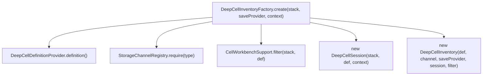
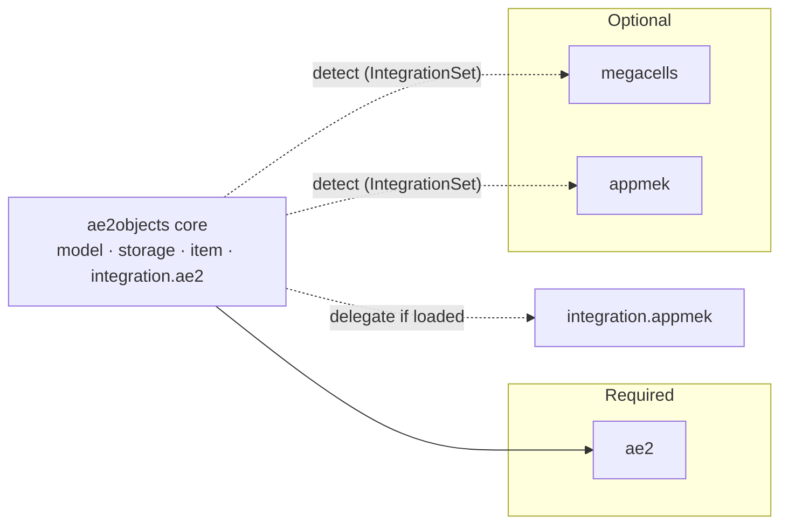

# Architecture

This document describes the internal architecture of AE2Objects after the *Deep Cell Platform*
refactor: a single storage implementation that carries the full product matrix

```text
Item / Fluid / Chemical  ×  1k .. 256m  ×  Drive / Portable
```

It supersedes the pre-refactor architecture (the `DeepCellSpec` design). The historical work items
live in [`implementation-plan.md`](implementation-plan.md); the *why* is in
[`refactor-plan.md`](refactor-plan.md).

## 1. Design goals

- **One storage engine** for every AE key type and every form.
- **No type limit**: capacity depends only on the total native amount vs. the byte capacity.
- **Three independent axes** that never leak into each other:
  `CellContentType` (product), `CellTier` (numbers), `CellForm` (interaction/UI).
- **Optional integrations never leak foreign classes** into shared packages.
- Registration, models, upgrades, creative tab, recipes and datagen all consume one catalog instead
  of parallel hard-coded lists.
- Preserve registry IDs, the SavedData identity and the persisted NBT layout.

Non-goals: replacing AE2's storage framework; making MEGA Cells / Applied Mekanistics required;
redesigning AE2's partition/upgrade/menu behavior.

## 2. Package layout

| Package                     | Responsibility                                                                                                                                             |
|-----------------------------|------------------------------------------------------------------------------------------------------------------------------------------------------------|
| `top.likoslupus.ae2objects` | NeoForge entry point (`Ae2Objects`) and `id(...)`.                                                                                                         |
| `...cell.model`             | Pure product model: `CellContentType`, `CellTier`, `CellForm`, `CellDefinition`, `DeepCellCatalog`, `CellCapacity`, `CellUpgradeProfile`.                  |
| `...cell.channel`           | Runtime channel abstraction: `StorageChannelBinding`, `StorageChannelRegistry`, `PortableMenuBinding`, `PortableMenuRegistry`.                             |
| `...cell.storage`           | Storage engine: `DeepCellContents`, `DeepCellSession`, `DeepCellFilter`, `NestedCellPolicy`, `DeepCellInventoryFactory`.                                   |
| `...cell.inventory`         | AE2 `StorageCell` adapter + handler: `DeepCellInventory`, `DeepCellHandler`.                                                                               |
| `...cell.persistence`       | UUID repository: `CellRecord`, `CellRepository`, `SavedDataCellRepository`, `CellContentsCodec`.                                                           |
| `...cell.stack`             | Client projection: `CellStackData`, `CellStackSnapshot`, `CellView`.                                                                                       |
| `...cell.item`              | Item forms: `DeepCellDefinitionProvider`, `DeepDriveCellItem`, `DeepPortableCellItem`, `CellWorkbenchSupport`, `CellCloneService`.                         |
| `...cell.ui`                | Tooltip projection (`DeepCellTooltip`).                                                                                                                    |
| `...platform`               | `IntegrationSet`, `IntegrationId`, `ServerCellContext`.                                                                                                    |
| `...registry`               | NeoForge registration + catalog: `ModItems`, `ModDataComponents`, `RegisteredCells`, `RegisteredHousings`, `CellRegistrationPlan`, `CellComponentSources`. |
| `...integration.ae2`        | Required AE2 bindings: `Ae2Bootstrap`, `ItemChannelBinding`, `FluidChannelBinding`, `Ae2Integration`.                                                      |
| `...integration.appmek`     | Optional Applied Mekanistics seam (`AppMekIntegration`).                                                                                                   |
| `...data`                   | Data generation: recipes, MEGA conditional recipes, GameTest structures.                                                                                   |
| `...command`                | `/ae2objects` commands.                                                                                                                                    |
| `...client`                 | Client-only bootstrap.                                                                                                                                     |
| `...mixin`                  | Container-copy hook for independent UUID cloning.                                                                                                          |
| `gametest` source set       | `GameTestRegistrar`, `GameTestFunctions`, `DeepCellTestSupport` (dev-only; not shipped).                                                                   |

> **Note:** the package is `registry`, not `content`. An earlier draft of the implementation plan
> proposed renaming it; that rename was deliberately skipped to avoid risky file moves.

## 3. Domain model

### 3.1 `CellContentType`

```java
ITEM("item",1L,true)

FLUID("fluid",1_000L,false)

CHEMICAL("chemical",1_000L,false)
```

Carries the ID fragment, the deep-cell **`amountPerByte`** (product rule, *not* AE2's own ratio) and
whether **fuzzy** partitioning is supported. It deliberately references no AE or foreign type.

### 3.2 `CellTier`

The single source of truth for tier prefix, byte capacity and idle drain:

```
1k 4k 16k 64k 256k | 1m 4m 16m 64m 256m
```

with helpers `ae2Tiers()` (`1k`–`256k`) and `megaTiers()` (`1m`–`256m`). Values are decimal
(`1m = 1,000,000`); see [`values.md`](values.md).

### 3.3 `CellForm`

`DRIVE` or `PORTABLE`. Form only changes interaction (menu/battery/disassembly) and the
portable-specific capacity/drain rules.

### 3.4 `CellDefinition`

`CellDefinition(type, tier, form)` is the **stable identity** of a cell; every derived ID lives
here:

```java
itemId()          // deep_<type>_storage_cell_<tier>  |  deep_portable_<type>_cell_<tier>

id()              // ae2objects:<itemId>

storageBytes()    // DRIVE: tier.bytes()   PORTABLE: tier.bytes() / 2

idleDrain()       // DRIVE: tier drain     PORTABLE: 1.0

inDriveModelId()  // block/drive/cells/deep_<type>_storage_cell_<tier>

translationKey()  // text.ae2objects.deep_<type>_storage_cells
```

It references no `AEKeyType`, `Item`, `DeferredItem`, `MenuType`, `SavedData` or foreign class.

### 3.5 `DeepCellCatalog`

The complete product model: `3 types × 10 tiers × 2 forms = 60` definitions (`DRIVE_CELLS`,
`PORTABLE_CELLS`, `ALL_CELLS`). This is a *catalog*, not the set of registered items (see
`CellRegistrationPlan`).

### 3.6 `CellCapacity`

Pure byte/native-unit math:

```text
totalAmount     = bytes * amountPerByte
usedBytes       = storedAmount / amountPerByte
freeBytes       = bytes - usedBytes
remainingAmount = totalAmount - storedAmount
isFull          = remainingAmount == 0
```

`remainingAmount` (not `freeBytes`) clamps insertion; there is no per-type overhead.

### 3.7 `CellUpgradeProfile`

Derived from `type × form`: which upgrades are sensible and how many slots exist.

| Type             | Form     | Fuzzy | Inverter | Void | Energy | Slots |
|------------------|----------|------:|---------:|-----:|-------:|------:|
| Item             | Drive    |     1 |        1 |    1 |      0 |     3 |
| Fluid / Chemical | Drive    |     0 |        1 |    1 |      0 |     2 |
| Item             | Portable |     1 |        1 |    1 |     ≤4 |     4 |
| Fluid / Chemical | Portable |     0 |        1 |    1 |     ≤4 |     3 |

The Equal Distribution Card is intentionally excluded: it divides capacity by the type count, which
is meaningless with no type limit.

## 4. Runtime channel abstraction

A `StorageChannelBinding` maps a product `CellContentType` to a concrete AE2 `AEKeyType` and decides
`accepts(AEKey)`:

```java
public interface StorageChannelBinding {

    CellContentType type();

    AEKeyType keyType();

    boolean accepts(AEKey key);

}
```

`StorageChannelRegistry` holds one binding per type. `Ae2Bootstrap` registers
`ItemChannelBinding` → `AEKeyType.items()` and `FluidChannelBinding` → `AEKeyType.fluids()`. The
optional chemical binding will be registered by `integration.appmek`.

`PortableMenuRegistry` mirrors this for menus (`MEStorageMenu.PORTABLE_ITEM_CELL_TYPE`,
`PORTABLE_FLUID_CELL_TYPE`, and later `AMMenus.PORTABLE_CHEMICAL_CELL_TYPE`).

## 5. Storage engine



### 5.1 `DeepCellContents`

The single source of truth for loaded amounts: an `Object2LongMap<AEKey>` plus derived
`totalAmount()` / `typeCount()`. There are **not** three drifting counters.

### 5.2 `DeepCellSession`

Owns the **per-ItemStack server lifecycle**: UUID, lazy load, dirty flag, repository access,
serialize/deserialize via `CellContentsCodec`, publish the client snapshot, and delete the record
when the cell becomes empty. It knows nothing about partition, fuzzy, capacity or `CellState`.

UUID lifecycle:

| Situation                             | Behaviour                                   |
|---------------------------------------|---------------------------------------------|
| New empty cell                        | no UUID, no record                          |
| `SIMULATE` insertion                  | no UUID, no record, no stack mutation       |
| First successful `MODULATE` insertion | allocate UUID + empty record                |
| Cell becomes empty                    | delete record, clear UUID + client snapshot |

### 5.3 `DeepCellInventory`

Implements AE2 `StorageCell` **only**:

```text
accept (channel) -> filter (partition/fuzzy) -> nested-cell policy -> capacity clamp
-> insert/extract/available/status/idle drain -> persistence via Session
```

It contains no `ITEM`/`FLUID`/`CHEMICAL`/`DRIVE`/`PORTABLE` branches and no concrete item
dependency. When the Overflow Destruction Card is installed and at least part of an insertion is
accepted, `insert` reports the full request as handled (the excess is destroyed); if there is no
space at all, nothing is voided.

### 5.4 `DeepCellFilter` and `NestedCellPolicy`

- `DeepCellFilter` is built from the cell's config inventory + upgrades + fuzzy mode; the engine
  only asks `accepts(AEKey)`. Fuzzy is honoured only when the type supports it and the Fuzzy Card is
  installed.
- `NestedCellPolicy` mirrors AE2's rule: an item that is itself a storage cell may only be stored if
  that cell reports `canFitInsideCell()`. Deep cells always report `false`, so they can never be
  nested.

## 6. Persistence

```text
ItemStack (cell_id UUID, cell_item_count, cell_type_count, fuzzy_mode, ae2:storage_cell_inv)
   │
   ▼
CellRepository  ── SavedDataCellRepository  (SavedData ae2objects:storage_manager)
   └─ Map<UUID, CellRecord>
        ├─ keys      (serialized AE keys)        [legacy name]
        ├─ amts      (parallel long amounts)     [legacy name]
        ├─ item_count (total native amount)      [legacy name]
        └─ cell_item  (source cell registry id)  [new, optional]
```

- `CellRepository` is a tiny interface (`find`/`contains`/`put`/`remove`) that must not mention
  `HolderLookup`, `MinecraftServer`, `ItemStack` or `AEKey`.
- `CellContentsCodec` is the **only** place that touches `AEKey.CODEC`, `NbtOps` and registries. It
  repairs invalid keys, wrong key types, zero/negative amounts, duplicate keys, length mismatches
  and stored-amount mismatches, and reports whether it repaired.
- `ServerCellContext(repository, registries)` is installed on `ServerStartedEvent` and cleared on
  `ServerStoppedEvent`; `platform` owns this lifecycle.

## 7. Client projection

Server and client are two different models; the client never reaches `SavedDataCellRepository`.

```java
public record CellStackSnapshot(
        @Nullable UUID id,
        long storedAmount,
        int storedTypes,
        List<GenericStack> preview,
        FuzzyMode fuzzyMode
) {

}
```

`CellStackData` is the **sole owner** of the ItemStack data-component contract; `CellView` holds
pure status/capacity projections; `DeepCellTooltip` reads only the snapshot + workbench state and
never constructs a storage inventory. See §9 for the component table.

## 8. Item layer

- `DeepCellDefinitionProvider.definition()` — the item's `CellDefinition`.
- `DeepDriveCellItem extends Item implements DeepCellDefinitionProvider, ICellWorkbenchItem,
  AEToolItem` — drive/chest form; interaction, workbench bridge, tooltip and disassembly trigger.
- `DeepPortableCellItem extends AbstractPortableCell implements DeepCellDefinitionProvider` —
  **not** `IBasicCellItem`, so AE2's type/slot limits never apply; it reuses AE2's battery, menu
  opening, dye colour and energy-aware disassembly.
- `CellWorkbenchSupport` resolves channel + upgrade profile from the definition and provides
  `config(...)`, `upgrades(..., onChanged)`, `fuzzyMode(...)`, `setFuzzyMode(...)` for both forms.
- `CellCloneService.copyIndependent(stack)` performs clone (fresh UUID + deep copy); the mixin
  (`DeepCellCopyMixin`) only calls it, and never invents a UUID client-side.

## 9. Data components

| Registry ID                  | Meaning                                             | Type                 |
|------------------------------|-----------------------------------------------------|----------------------|
| `ae2objects:cell_id`         | storage identity                                    | `UUID`               |
| `ae2objects:cell_item_count` | stored **native amount** (legacy name kept)         | `long`               |
| `ae2objects:cell_type_count` | stored distinct key count                           | `int`                |
| `ae2objects:fuzzy_mode`      | item-cell fuzzy mode                                | `FuzzyMode`          |
| `ae2:storage_cell_inv`       | AE2 client preview (≤10 entries, amount descending) | `List<GenericStack>` |

## 10. Registration and content

- `DeepCellCatalog` = the 60 product definitions.
- `CellRegistrationPlan` selects the active subset: item + fluid (including MEGA tiers) are always
  active; chemical is active only once a chemical `StorageChannelBinding` exists.
- `RegisteredCells` = `Map<CellDefinition, DeferredItem<?>>` (the registry handle only).
- `RegisteredHousings` = `Map<CellContentType, DeferredItem<Item>>`.
- `CellComponentSources.forTier(tier)` = the tier's storage component:
  `1k`–`256k` → `ae2:cell_component_*` (no mod); `1m`–`256m` → `megacells:cell_component_*`
  (optional MEGA mod).
- `ModItems.defineContent(IntegrationSet)` registers housings + active drive/portable cells.
- `Ae2Integration` registers the cell handler, drive models, upgrades and (for portables) the
  NeoForge energy capability.

Creative tab order: item housing, fluid housing, chemical housing, all non-portable cells, all
portable cells — sorted by `form → type → tier`, and each powered (portable) item also gets a
fully-charged copy.

## 11. Optional integrations



- **MEGA Cells** only affects the **component source** and the **recipe condition**. MEGA-tier cells
  are always registered (stable IDs); only their recipes are gated by `neoforge:mod_loaded`.
- **Applied Mekanistics** is a mod-id-gated skeleton (`AppMekIntegration`) that reserves the
  chemical channel + portable menu. It references no appmek/Mekanism class. `CellRegistrationPlan`
  activates chemical content automatically once the channel is registered.
- `IntegrationSet.detect()` centralizes `ModList` lookups; detection is not scattered across items,
  inventory, tooltips and datagen.

## 12. Bootstrap and lifecycle

```mermaid
sequenceDiagram
    participant Mod as Ae2Objects (ctor)
    participant Boot as Ae2Bootstrap
    participant Int as AppMekIntegration
    participant Items as ModItems
    participant Server as Server lifecycle
    Mod ->> Boot: bootstrapRequired() (item + fluid channels, portable menus)
    Mod ->> Int: bootstrapRequired(IntegrationSet.detect())
    Mod ->> Items: defineContent(integrations); register(modBus); ModDataComponents.register
Mod->>Mod: Ae2Integration.initCommon/registerCapabilities, creative tab
Server-->>Mod: ServerStartedEvent -> ServerCellContext.onServerStarted
Server-->>Mod: ServerStoppedEvent -> ServerCellContext.onServerStopped
```

Foreign classes are only touched after the corresponding mod is confirmed loaded.

## 13. Game tests

A dedicated `gametest` source set (added to the dev mod, excluded from the release jar) registers
NeoForge `GameTest`s: storage-engine cases (insert/extract, capacity clamp, UUID lifecycle,
persistence, partition, fuzzy, nested-cell rejection), block compatibility (ME Chest, ME Drive) and
portable/interaction cases (power, menu host, container-menu clone, recovery). The all-air plot
structure is generated by `GameTestStructureProvider` and is excluded from the release jars.

## 14. Extension guide

> A new key type, tier or form may add a `CellDefinition`/tier value, a channel binding, a
> registration and resources. It must **not** add a new inventory, persistence manager, capacity
> algorithm or a key-type `if/else` in the engine.

- **New tier** — add a `CellTier` value and a `CellComponentSource`; the catalog and registration
  pick it up.
- **New key type** — add a `CellContentType` + a `StorageChannelBinding` (+ portable menu binding);
  register it from the owning integration. The engine is unchanged.
- **New form** — add a `CellForm` and an item implementation implementing
  `DeepCellDefinitionProvider`; reuse `CellWorkbenchSupport` + `CellCloneService`.

## 15. Dependency rule (hard constraint)

| Package              | May depend on                                                                                    | Must not depend on                                         |
|----------------------|--------------------------------------------------------------------------------------------------|------------------------------------------------------------|
| `cell.model`         | JDK, `Identifier`                                                                                | AE/NeoForge, `Item`, registries, `SavedData`, foreign mods |
| `cell.channel`       | `cell.model`, AE `AEKey` API                                                                     | item classes, `SavedData`, registration, foreign mods      |
| `cell.storage`       | `cell.model`, `cell.channel`, `cell.persistence`/`cell.stack` abstractions, AE `StorageCell` API | foreign mods, concrete item classes, datagen, commands     |
| `cell.persistence`   | AE key codecs, Minecraft `SavedData`/NBT                                                         | item classes, foreign mods                                 |
| `cell.item`          | `model`, `stack`, workbench support, AE item APIs                                                | `SavedData` maps, AE key codecs                            |
| `integration.appmek` | core + AppMek + Mekanism (future)                                                                | nothing depends back on it                                 |
