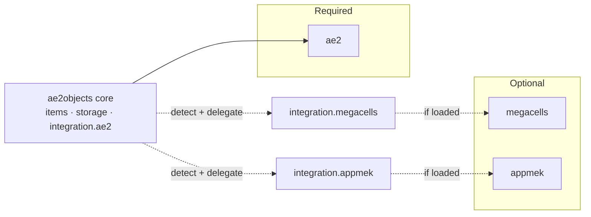

# Integrations

AE2Objects integrates with **Applied Energistics 2** (required) and, optionally, with
**MEGA Cells** and **Applied Mekanistics** (appmek). This document describes each integration, its
IDs, and the rules that keep optional mods safe to load.

## 1. Vanilla AE2 — fluids

AE2's fluid channel is `AEKeyType.fluids()`, backed by `AEFluidKey`. Deep fluid cells accept it
directly; there is no extra dependency.

| Property | Value |
| --- | --- |
| Key type | `appeng.api.stacks.AEKeyType.fluids()` |
| Key class | `appeng.api.stacks.AEFluidKey` |
| `amountPerUnit` (`getAmountPerUnit()`) | `1000` (`AEFluidKey.AMOUNT_BUCKET`) |
| Unit symbol | `B` |
| Deep fluid housing | `ae2objects:deep_fluid_cell_housing` |

Because `amountPerUnit = 1000`, one byte of a deep fluid cell stores 1000 mB (one bucket). See
[`values.md`](values.md).

## 2. MEGA Cells (optional)

[MEGA Cells](https://github.com/62832/MEGACells) adds `1M`–`256M` storage tiers. AE2Objects mirrors
those tier *sizes* with its own deep cells, using MEGA's storage components in the recipes.

| Aspect | Value |
| --- | --- |
| Mod ID | `megacells` |
| Tiers mirrored | `1m`, `4m`, `16m`, `64m`, `256m` |
| Components | `megacells:cell_component_1m`, `_4m`, `_16m`, `_64m`, `_256m` |
| MEGA housings | `megacells:mega_item_cell_housing`, `mega_fluid_cell_housing`, `mega_chemical_cell_housing` |
| Deep housings used | **own** `ae2objects:deep_*_cell_housing` (decision) |

**Value difference (expected).** MEGA's tiers are binary: `bytes = 1024 × 4^(index-1)`, so
`1M = 1,048,576` bytes. AE2Objects uses decimal: `1M = 1,000,000` bytes. The names match; the exact
byte counts intentionally do not. See the appendix in [`values.md`](values.md).

MEGA-tier deep cells are always **registered** (stable IDs) but only **craftable** when MEGA Cells is
loaded, because the recipes reference `megacells:cell_component_*`.

## 3. Applied Mekanistics (optional)

[Applied Mekanistics](https://github.com/ramidzkh/Applied-Mekanistics) (appmek) exposes Mekanism
chemicals over AE2 via `me.ramidzkh.mekae2`. AE2Objects adds deep chemical cells for this channel.

| Aspect | Value |
| --- | --- |
| Mod ID | `appmek` |
| Key type | `me.ramidzkh.mekae2.ae2.MekanismKeyType.TYPE` |
| Key class | `me.ramidzkh.mekae2.ae2.MekanismKey` |
| Portable menu | `me.ramidzkh.mekae2.AMMenus.PORTABLE_CHEMICAL_CELL_TYPE` |
| Content validator | `mekanism.api.chemical.attribute.ChemicalAttributeValidator.DEFAULT` |
| Deep chemical housing | `ae2objects:deep_chemical_cell_housing` |

Reference appmek item IDs (used for recipes / interop):

| appmek item | ID |
| --- | --- |
| Chemical housing | `appmek:chemical_cell_housing` |
| Chemical cells | `appmek:chemical_storage_cell_1k` … `_256k` |
| Portable chemical cells | `appmek:portable_chemical_storage_cell_1k` … `_256k` |
| Creative chemical cell | `appmek:creative_chemical_cell` |
| Chemical P2P tunnel | `appmek:chemical_p2p_tunnel` |

**Chemical validation.** Deep chemical cells reject invalid chemicals on insert:

```java
requestedAddition instanceof MekanismKey key
    && ChemicalAttributeValidator.DEFAULT.process(key.getStack())
```

The `amountPerUnit` for `MekanismKeyType.TYPE` is taken to be `1000`, consistent with fluids and with
AE-Additions' `divisible = 1000` handling (verify against the pinned appmek build when implementing).

## 4. Soft-dependency rules

Foreign mods must never be required to load AE2Objects.

1. **Runtime detection**

   ```java
   if (ModList.get().isLoaded("megacells")) { MegaCellsIntegration.init(); }
   if (ModList.get().isLoaded("appmek"))    { AppMekIntegration.init(); }
   ```

2. **Class isolation** — every reference to a foreign class lives only inside its
   `integration.<mod>` package. Those classes are not touched unless the mod is loaded, preventing
   `NoClassDefFoundError`.

3. **Item lookup by ID** — foreign items are resolved through
   `BuiltInRegistries.ITEM.get(Identifier.fromNamespaceAndPath("megacells", "cell_component_1m"))`
   (or reflection on the foreign `DeferredItem`), never via a hard import in shared code.

4. **Conditional recipes** — recipes referencing foreign items are gated:

   ```json
   { "type": "neoforge:mod_loaded", "modid": "megacells" }
   ```

   so they are skipped when the dependency is absent.



## 5. Declaration in `neoforge.mods.toml`

```toml
[[dependencies.ae2objects]]
modId = "ae2"
type = "required"
versionRange = "[26.1.10-beta, 26.2.0)"
ordering = "AFTER"
side = "BOTH"

[[dependencies.ae2objects]]
modId = "megacells"
type = "optional"
versionRange = "*"
ordering = "AFTER"
side = "BOTH"

[[dependencies.ae2objects]]
modId = "appmek"
type = "optional"
versionRange = "*"
ordering = "AFTER"
side = "BOTH"
```

Exact version ranges are finalized against the pinned NeoForge/Minecraft versions at implementation
time.

## 6. Build dependencies

Add the optional integrations as `compileOnly` so shared code can reference their APIs without
shipping them:

```kotlin
dependencies {
    implementation(libs.ae2)            // required
    compileOnly(libs.megacells)         // optional
    compileOnly(libs.appmek)            // optional
}
```

Versions are declared in `gradle/libs.versions.toml`.

## 7. Recipe source of foreign components

| Deep cell tier | Component used |
| --- | --- |
| `1k`–`256k` | `ae2:cell_component_1k` … `ae2:cell_component_256k` |
| `1m`–`256m` | `megacells:cell_component_1m` … `megacells:cell_component_256m` (requires MEGA Cells) |

Chemical deep cells use the same components as items/fluids; only the housing and key type differ.
